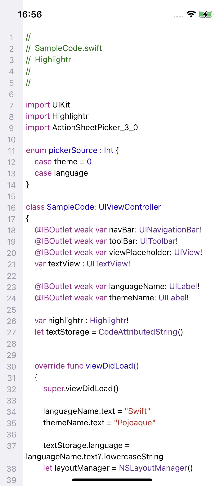

# CNHighlightr

[](https://travis-ci.org/mengruirui/CNHighlightr)
[](https://cocoapods.org/pods/CNHighlightr)
[](https://cocoapods.org/pods/CNHighlightr)
[](https://cocoapods.org/pods/CNHighlightr)

## 关于
CNHighlightr 是用Objective-C构建的，一个用于iOS代码高亮的组件，并且支持设置行号。它使用highlight.js作为核心，支持多种语言与主题样式。

## Example



To run the example project, clone the repo, and run `pod install` from the Example directory first.

```
NSString *code = [NSString stringWithContentsOfFile:[[NSBundle mainBundle] pathForResource:@"sampleCode" ofType:@"txt"] encoding:NSUTF8StringEncoding error:NULL];

CNCodeTextView *codeView = [[CNCodeTextView alloc] initWithFrame:self.view.frame];
[self.view addSubview:codeView];
codeView.text = code;
codeView.language = @"swift"; //支持语言列表查看 Samples 目录
codeView.themeName = @"xcode";//支持主题列表查看 styles 目录
codeView.codeFont = [UIFont systemFontOfSize:14];
//行高
codeView.lineSpacing = 3;
//是否可以编辑
[codeView setEditable:NO];
//长按是否有选择弹窗
[codeView setSelectable:NO];

codeView.lineNumberHidden = NO;
codeView.lineNumberBackgroundColor = [UIColor colorWithRed:240/255.0 green:240/255.0 blue:245/255.0 alpha:1.0];
codeView.lineNumberTextColor = [UIColor colorWithRed:153/255.0 green:154/255.0 blue:170/255.0 alpha:1.0];
codeView.lineNumberBorderColor = [UIColor colorWithRed:240/255.0 green:240/255.0 blue:245/255.0 alpha:1.0];
codeView.lineNumberFont = [UIFont systemFontOfSize:14];
codeView.lineNumberWidth = 40;
codeView.lineNumberAlignment = CNCodeNumberAlignmentCenter;
```

## Requirements

## Installation

CNHighlightr is available through [CocoaPods](https://cocoapods.org). To install
it, simply add the following line to your Podfile:

```ruby
pod 'CNHighlightr'
```

## Author

mengruirui, mengrr@csdn.net

## License

CNHighlightr is available under the MIT license. See the LICENSE file for more info.
